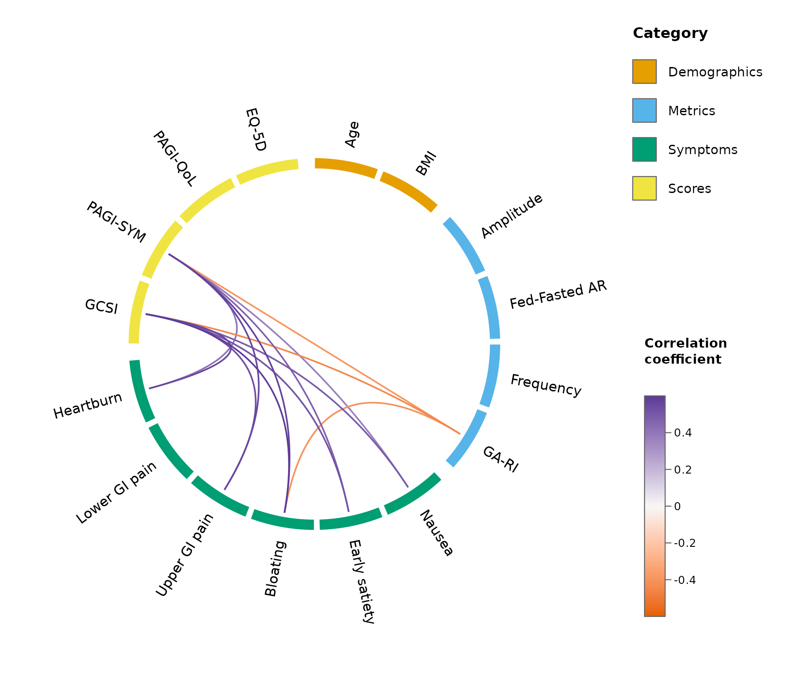
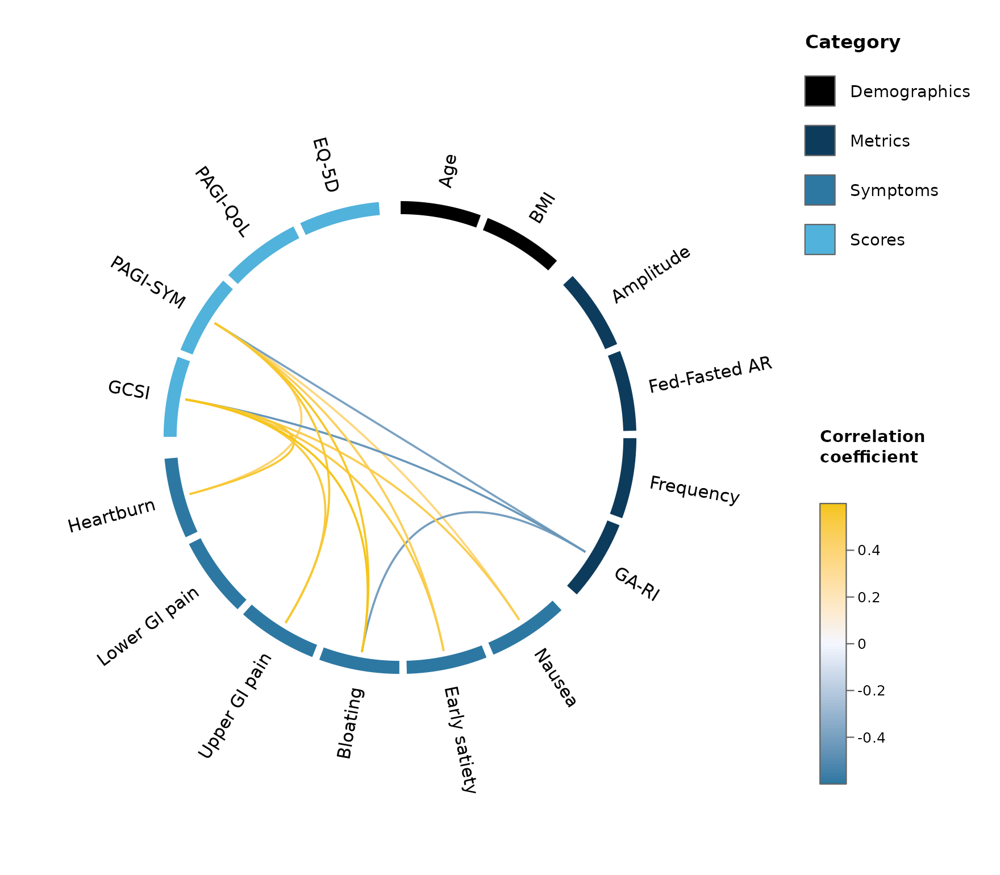
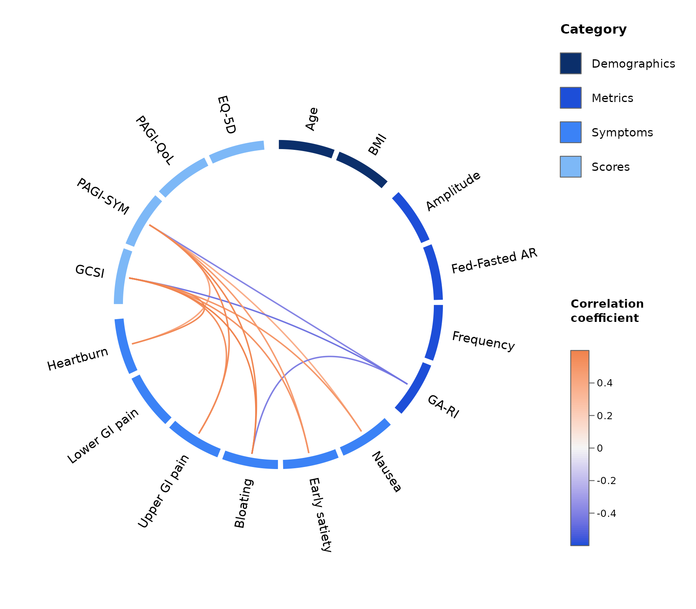
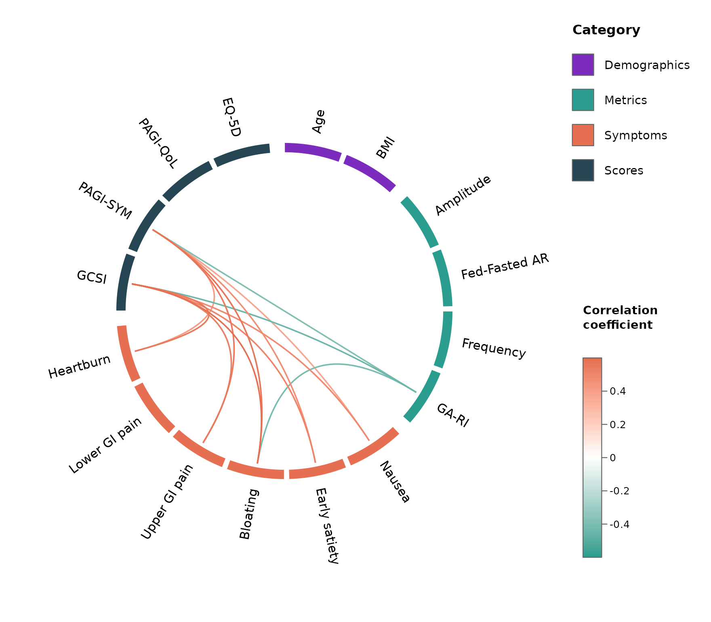
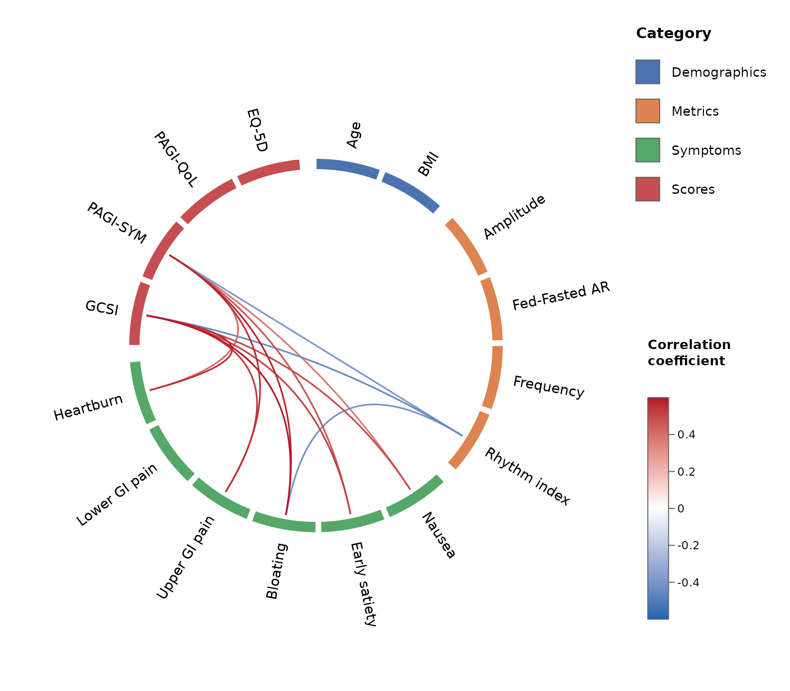
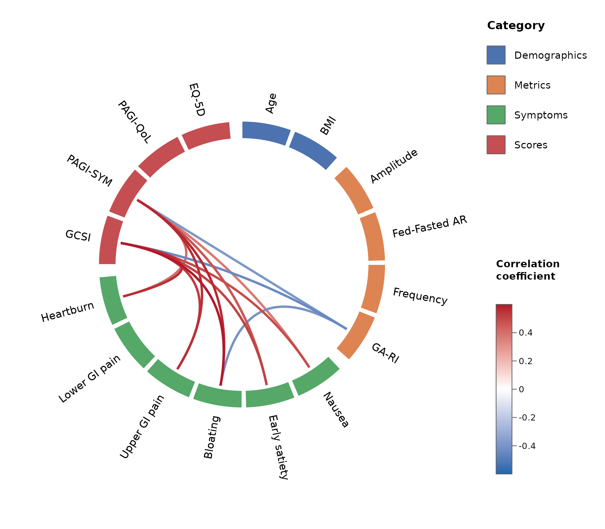
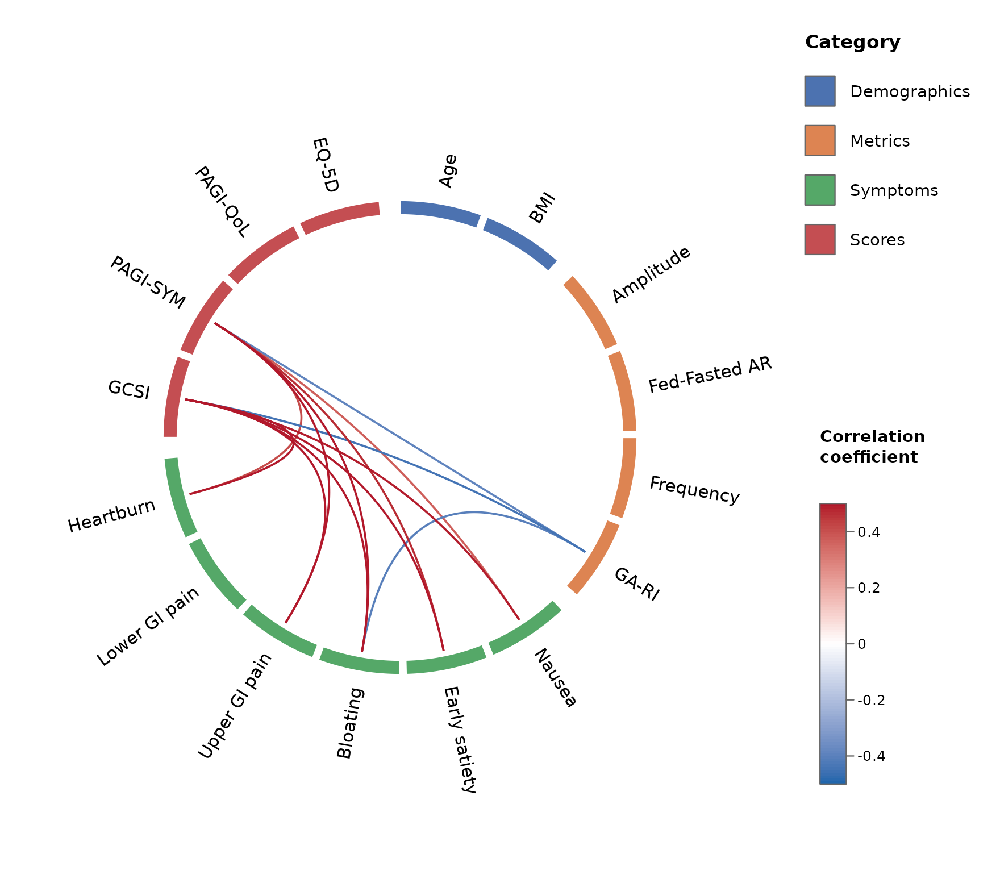

# Correlation wheel plots with circlecorR

``` r

library(circlecorR)
```

## Motivation

A traditional correlation matrix carries a large amount of **redundant
information**. For $`k`$ variables it has $`k^2`$ cells, but only
$`k(k-1)/2`$ of them are unique: the diagonal is all self-correlations
($`r = 1`$), the two triangles mirror each other, and large blocks of
*within-category* correlations are often irrelevant, and contribute to
reduced statistical power. As $`k`$ grows, the interesting
**between-category** relationships are buried in this redundancy and the
figure becomes unreadable.

The **correlation wheel** was introduced by Gharibans et al in the first
clinical paper to show that spatial dysrhythmias as measured on the body
surface, correlated with gastroduodenal symptoms (Gharibans et al.
2019). The correlation wheel shows variables at the periphery of a
circle, grouped by category, and only the correlations of interest are
drawn as curved links coloured by the strength of their coefficient, and
filtered based on custom statistical significance thresholds.
`circlecorR` reproduces these features to generate a correlation wheel
plot using standard patient-per-row type dataframes in R, with
optionality to customise the grouping, colours, and statistics.

## Installation

``` r

# install.packages("remotes")
remotes::install_github("kriz98/circlecorR", build_vignettes = TRUE)
```

*(CRAN release pending.)*

Dependencies (`circlize` and `psych`) install automatically with the
command above.

## Quick start: straight from your data

`circlecorR` is designed to work straight from a data frame – **one row
per subject** and **one column per variable** – with no separate step to
build correlation matrices yourself. Hand that data frame directly to
[`corr_wheel()`](https://kriz98.github.io/circlecorR/reference/corr_wheel.md)
and it computes the correlations (and p-values) for you.

The only other thing you supply is `groups`: a named list mapping each
category to its variables. This both **selects** which variables appear
(any other columns, such as an ID, are ignored) and sets their **order**
around the wheel.

In homage to Gharibans et al seminal paper, we use a synthetic
`gastro_symptoms` dataset throughout this vignette (see
[`?gastro_symptoms`](https://kriz98.github.io/circlecorR/reference/gastro_symptoms.md)
for its exact shape). This synthetic example dataset is bundled with the
package. Swap it for your own data frame (one row per subject) to use
your own data.

Other notable papers with where these figures were used include:

- Gharibans AA, Coleman TP, Mousa H, Kunkel DC. Spatial patterns from
  high-resolution electrogastrography correlate with severity of
  symptoms in patients with functional dyspepsia and gastroparesis. Clin
  Gastroenterol Hepatol. 2019 Dec;17(13):2668–77.
- Gharibans AA, Calder S, Varghese C, Waite S, Schamberg G, Daker C, et
  al. Gastric dysfunction in patients with chronic nausea and vomiting
  syndromes defined by a noninvasive gastric mapping device. Sci Transl
  Med. 2022 Sept 21;14(663):eabq3544.
- Wang TH-H, Varghese C, Calder S, Gharibans A, Schamberg G, Bartlett A,
  et al. Long-term evaluation of gastric electrophysiology, symptoms and
  quality of life after pancreaticoduodenectomy. HPB (Oxford). 2025
  Dec;27(12):1535–42.
- Xu W, Wang T, Foong D, Schamberg G, Evennett N, Beban G, et
  al. Characterization of gastric dysfunction after fundoplication using
  body surface gastric mapping. J Gastrointest Surg. 2024
  Mar;28(3):236–45.
- Xu W, Gharibans AA, Calder S, Schamberg G, Walters A, Jang J, et
  al. Defining and phenotyping gastric abnormalities in long-term type 1
  diabetes using a novel body surface gastric mapping device. Gastro Hep
  Adv. 2023 Aug 18;2(8):1120–32.

``` r

groups <- list(
  Demographics = c("Age", "BMI"),
  Metrics      = c("Amplitude", "Fed-Fasted AR", "Frequency", "GA-RI"),
  Symptoms     = c("Nausea", "Early satiety", "Bloating",
                   "Upper GI pain", "Lower GI pain", "Heartburn"),
  Scores       = c("GCSI", "PAGI-SYM", "PAGI-QoL", "EQ-5D")
)
```

``` r

# `gastro_symptoms` is a synthetic per-row example dataset shipped with the package
head(gastro_symptoms[, 1:5])
#>   Age  BMI Amplitude Fed-Fasted AR Frequency
#> 1  74 41.0  30.26932     2.0004345  2.808546
#> 2  51 42.8  29.15670     0.7884043  1.760702
#> 3  59 36.2  29.73068     0.1899037  3.483917
#> 4  47 40.8  31.16330    -0.8294263  2.842009
#> 5  29 46.1  31.07111     0.9579552  4.015299
#> 6  50 36.4  29.86780    -2.0601868  1.179358

corr_wheel(
  gastro_symptoms,             # raw data: one row per subject
  groups      = groups,
  method      = "pearson",     # correlation method
  adjust      = "hochberg",    # multiple-comparison adjustment (see below)
  sig_level   = 0.05,          # hide links with adjusted p > 0.05
  r_threshold = 0.3,           # ...and links with |r| < 0.3
  r_limits    = c(-0.6, 0.6)
)
```


## Hiding self- and within-category correlations

Two of the wheel’s most important features are that it **never draws
self-correlations** (the diagonal) and, by default, **hides
within-category correlations** (`hide_within_group = TRUE`). This
removes the redundant parts of the matrix and leaves the
between-category structure.

Crucially, this is carried through to the **statistics**.
Multiple-comparison correction penalises you for the number of
hypotheses tested. If self- and within-category correlations are never
tested, they should not count towards that family.
[`corr_wheel()`](https://kriz98.github.io/circlecorR/reference/corr_wheel.md)
therefore applies the adjustment over **only the correlations it
displays**. Shrinking the family makes the correction less severe, thus
improving power, while remaining statistically consistent with what is
shown.

``` r

res <- corr_wheel(gastro_symptoms, groups = groups, adjust = "hochberg",
                  r_threshold = 0.3, r_limits = c(-0.6, 0.6))
```


``` r


k <- length(unlist(groups))
cat("Unique correlations in the full matrix:", k * (k - 1) / 2, "\n")
#> Unique correlations in the full matrix: 120
cat("Correlations actually tested (the family):", res$n_tests, "\n")
#> Correlations actually tested (the family): 92
```

Because the family is smaller, each raw p-value is corrected by a
smaller factor. Taking Bonferroni for a transparent example, the *same*
correlation is penalised by the number of tests in its family – here 92
rather than 120:

``` r

p_raw <- 5e-4                       # a raw p-value for one correlation
k_all <- k * (k - 1) / 2

cat("Bonferroni across the full matrix:", signif(p_raw * k_all, 3), "\n")
#> Bonferroni across the full matrix: 0.06
cat("Bonferroni across the family only:", signif(p_raw * res$n_tests, 3), "\n")
#> Bonferroni across the family only: 0.046
```

The step-up methods (`"holm"`, `"hochberg"`, `"BH"`) behave the same
way.

If you want the correlation and p-value matrices themselves, for a
table, a report, or any other purpose –
[`compute_correlations()`](https://kriz98.github.io/circlecorR/reference/compute_correlations.md)
is the same function
[`corr_wheel()`](https://kriz98.github.io/circlecorR/reference/corr_wheel.md)
calls internally, available on its own:

``` r

cc <- compute_correlations(gastro_symptoms, method = "pearson")
str(cc)
#> List of 4
#>  $ r     : num [1:16, 1:16] 1 0.000715 -0.094705 -0.208429 -0.007022 ...
#>   ..- attr(*, "dimnames")=List of 2
#>   .. ..$ : chr [1:16] "Age" "BMI" "Amplitude" "Fed-Fasted AR" ...
#>   .. ..$ : chr [1:16] "Age" "BMI" "Amplitude" "Fed-Fasted AR" ...
#>  $ p     : num [1:16, 1:16] 0 0.9944 0.3486 0.0374 0.9447 ...
#>   ..- attr(*, "dimnames")=List of 2
#>   .. ..$ : chr [1:16] "Age" "BMI" "Amplitude" "Fed-Fasted AR" ...
#>   .. ..$ : chr [1:16] "Age" "BMI" "Amplitude" "Fed-Fasted AR" ...
#>  $ n     : num 100
#>  $ method: chr "pearson"
#>  - attr(*, "class")= chr "circlecor"
```

## Customising the look

### Colour schemes

`scheme` sets the category colours and the diverging link palette
together, as one named preset. Built-in options are listed by
[`corr_wheel_schemes()`](https://kriz98.github.io/circlecorR/reference/corr_wheel_schemes.md):

``` r

corr_wheel_schemes()
#> [1] "default"    "colorblind" "ocean"      "vivid"      "alimetry"
```

- `"default"` – the seaborn-like categorical palette and a
  blue-white-red diverging scale used throughout this vignette.
- `"colorblind"` – the Okabe-Ito categorical palette with a
  colourblind-safe (PuOr) diverging scale.
- `"ocean"` – hue-varied cool tones (teal, blue, indigo, violet, slate)
  for categories, with a blue-to-warm diverging scale.
- `"vivid"` – a brighter, higher-contrast categorical palette, still
  paired with the blue-white-red diverging scale.
- `"alimetry"` – black and shades of blue through cyan for most
  categories, with a single gold used as a sparing highlight, and a
  matching blue-to-yellow diverging scale.

``` r

corr_wheel(gastro_symptoms, groups = groups, r_threshold = 0.3,
          r_limits = c(-0.6, 0.6), scheme = "colorblind")
```



``` r

corr_wheel(gastro_symptoms, groups = groups, r_threshold = 0.3,
          r_limits = c(-0.6, 0.6), scheme = "alimetry")
```



[`corr_wheel_scheme()`](https://kriz98.github.io/circlecorR/reference/corr_wheel_scheme.md)
returns a scheme’s definition so you can start from a preset and tweak
it – here, lightening the midpoint of the diverging scale:

``` r

s <- corr_wheel_scheme("ocean")
s$palette[2] <- "grey96"
corr_wheel(gastro_symptoms, groups = groups, r_threshold = 0.3,
          r_limits = c(-0.6, 0.6), scheme = s)
```



Or build one entirely from scratch by passing
`list(colors = , palette = )` directly – `colors` is an unnamed vector
cycled across however many categories you have, and `palette` is the
length-3 diverging scale (negative, midpoint, positive):

``` r

corr_wheel(gastro_symptoms, groups = groups, r_threshold = 0.3,
          r_limits = c(-0.6, 0.6),
          scheme = list(colors = c("#7B2CBF", "#2A9D8F", "#E76F51", "#264653"),
                       palette = c("#2A9D8F", "white", "#E76F51")))
```



### Colours and labels

`colors` maps categories to colours, layered on top of `scheme` (or the
default palette if `scheme` is `NULL`) – only the categories you name
are overridden. `labels` gives pretty display names. Both are named
vectors – specify only the ones you want to change.

``` r

corr_wheel(
  gastro_symptoms, groups = groups, r_threshold = 0.3, r_limits = c(-0.6, 0.6),
  scheme = "colorblind",
  colors = c(Scores = "black"),          # override just one category
  labels = c("GA-RI" = "Rhythm index")
)
```



### Size of blocks and lines

- `tile_height` – radial thickness of the category **blocks** (smaller =
  thinner).
- `link_lwd` – **line** width of the links (larger = thicker).

``` r

corr_wheel(
  gastro_symptoms, groups = groups, r_threshold = 0.3, r_limits = c(-0.6, 0.6),
  tile_height = 0.12,   # thicker blocks
  link_lwd    = 3       # thicker lines
)
```



### The diverging colour scale

`palette` sets the three colours at `c(-limit, 0, +limit)` (overriding
`scheme`’s) and `r_limits` the scale range.

``` r

corr_wheel(
  gastro_symptoms, groups = groups, r_threshold = 0.3,
  palette  = c("#2166AC", "white", "#B2182B"),   # blue - white - red
  r_limits = c(-0.5, 0.5)
)
```



## Saving to a file

[`corr_wheel()`](https://kriz98.github.io/circlecorR/reference/corr_wheel.md)
draws on the active graphics device, so save it the usual way:

``` r

png("correlation_wheel.png", width = 2500, height = 2000, res = 300)
corr_wheel(gastro_symptoms, groups = groups, r_threshold = 0.3,
           r_limits = c(-0.6, 0.6))
dev.off()
```

## Argument reference

Everything covered above, at a glance:

| What | Argument | Example |
|----|----|----|
| Category assignment & order | `groups` | named list *or* `variable = category` vector |
| Colour scheme (category colours + link palette, together) | `scheme` | `"colorblind"`, `"ocean"`, `"vivid"`, `"alimetry"`, or `list(colors=, palette=)` |
| Category colours | `colors` | `c(Symptoms = "#55A868", Scores = "#C44E52")` (overrides `scheme` per category) |
| Pretty variable labels | `labels` | `c("GA-RI" = "Rhythm index")` |
| Significance cutoff | `sig_level` | `0.05` |
| Multiple-comparison adjustment | `adjust` | `"holm"`, `"hochberg"`, `"BH"`, `"none"` |
| Minimum \|r\| shown | `r_threshold` | `0.3` |
| Hide within-category links | `hide_within_group` | `TRUE` / `FALSE` |
| Colour-scale range | `r_limits` | `c(-0.5, 0.5)` |
| Link colour ramp | `palette` | `c("#2166AC", "white", "#B2182B")` (overrides `scheme`’s) |
| Block size (thickness) | `tile_height` | `0.06` (thin) … `0.12` (thick) |
| Line size (width) | `link_lwd` | `1.6`, `3` |
| Rotation / spacing | `start_degree`, `group_gap`, `node_gap` |  |
| Legend / colour bar | `legend`, `colorbar` |  |

[`corr_wheel()`](https://kriz98.github.io/circlecorR/reference/corr_wheel.md)
returns (invisibly) the ordered variables, resolved group and colour
maps, the colour function, and the masked matrix actually plotted –
handy for reproducibility or building a caption.

## References

Gharibans, Armen A., Todd P. Coleman, Hayat Mousa, and David C. Kunkel.
2019. “Spatial Patterns from High-Resolution Electrogastrography
Correlate with Severity of Symptoms in Patients with Functional
Dyspepsia and Gastroparesis.” *Clinical Gastroenterology and Hepatology*
17 (13): 2668–77. <https://doi.org/10.1016/j.cgh.2019.04.039>.
