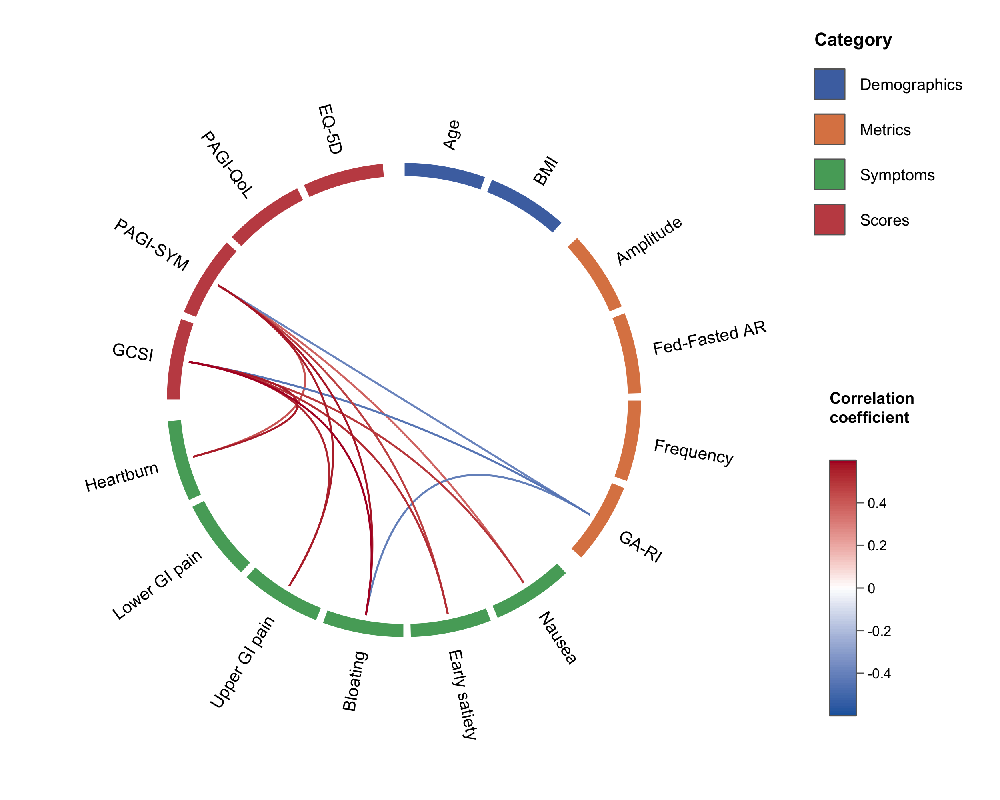

# circlecorR

**Circular correlation “wheel” plots in native R.**

`circlecorR` draws **correlation wheel** plots — variables arranged
around a ring, grouped and colour-tiled by category, connected by curved
links whose colour maps to the correlation coefficient — using
[`circlize`](https://github.com/jokergoo/circlize). It replaces the
older R → Python (`mne.viz.plot_connectivity_circle`) round-trip with a
single R call.

A traditional correlation matrix is mostly redundant: a diagonal of
self-correlations, two mirror-image triangles, and blocks of
within-category correlations that bury the between-category
relationships you care about. The wheel — introduced by Gharibans et
al. (2019) — keeps only those relationships. Hiding self- and
within-category correlations also **removes them from the
multiple-comparison family**, which improves statistical power (see
[`vignette("circlecorR")`](https://kriz98.github.io/circlecorR/articles/circlecorR.md)).



Example correlation wheel

## Installation

``` r

# install.packages("remotes")
remotes::install_github("kriz98/circlecorR", build_vignettes = TRUE)
```

*(CRAN release pending.)*

It needs `circlize`; `psych` is only required if you let the package
compute correlations for you (the raw-data path below).

``` r

install.packages(c("circlize", "psych"))
```

## Quick start — straight from your data

Most datasets are **one row per subject, one column per variable**. You
don’t need to build correlation matrices yourself: hand that data frame
to
[`corr_wheel()`](https://kriz98.github.io/circlecorR/reference/corr_wheel.md)
and it computes the correlations and p-values for you. The only other
thing you supply is `groups`, which both selects the variables and
orders them around the wheel (extra columns like IDs are ignored).

``` r

library(circlecorR)

groups <- list(
  Demographics = c("Age", "BMI"),
  Metrics      = c("Amplitude", "Fed-Fasted AR", "Frequency", "GA-RI"),
  Symptoms     = c("Nausea", "Early satiety", "Bloating",
                   "Upper GI pain", "Lower GI pain", "Heartburn"),
  Scores       = c("GCSI", "PAGI-SYM", "PAGI-QoL", "EQ-5D")
)

corr_wheel(
  my_data,                 # one row per subject
  groups      = groups,
  method      = "pearson",
  adjust      = "hochberg",
  sig_level   = 0.05,
  r_threshold = 0.3,
  r_limits    = c(-0.6, 0.6)
)
```

### From pre-computed r / p matrices (e.g. existing CSVs)

[`corr_wheel()`](https://kriz98.github.io/circlecorR/reference/corr_wheel.md)
auto-detects a correlation matrix, so the old two-file workflow still
works:

``` r

r <- as.matrix(read.csv("Rvalues.csv", row.names = 1))
p <- as.matrix(read.csv("Pvalues.csv", row.names = 1))
corr_wheel(r, p, groups = groups, r_threshold = 0.3)
```

### Save to file

``` r

png("correlation_wheel.png", width = 2400, height = 2000, res = 300)
corr_wheel(my_data, groups = groups, r_threshold = 0.3, r_limits = c(-0.6, 0.6))
dev.off()
```

See
[`vignette("circlecorR")`](https://kriz98.github.io/circlecorR/articles/circlecorR.md)
for the full tour.

## Flexibility

Everything the reference figure controls is a plain argument:

| What | Argument | Example |
|----|----|----|
| Category assignment & order | `groups` | named list *or* `variable = category` vector |
| Colour scheme (category colours + link palette, together) | `scheme` | `"colorblind"`, `"ocean"`, `"vivid"`, or `list(colors=, palette=)` |
| Category colours | `colors` | `c(Symptoms = "#55A868", Scores = "#C44E52")` (overrides `scheme` per category) |
| Pretty variable labels | `labels` | `c(`GA-RI`= "Rhythm index")` |
| Significance cutoff | `sig_level` | `0.05` |
| Multiple-comparison adjustment | `adjust` | `"holm"`, `"hochberg"`, `"BH"`, `"none"` |
| Minimum \|r\| shown | `r_threshold` | `0.3` |
| Hide within-category links | `hide_within_group` | `TRUE` / `FALSE` |
| Colour-scale range | `r_limits` | `c(-0.5, 0.5)` |
| Link colour ramp | `palette` | `c("#2166AC", "white", "#B2182B")` (overrides `scheme`’s) |
| Block size (thickness) | `tile_height` | `0.06` (thin) … `0.12` (thick) |
| Line size (width) | `link_lwd` | `1.6`, `3` |
| Rotation / spacing | `start_degree`, `group_gap`, `node_gap` |  |
| Legend / colour bar | `legend`, `colorbar` |  |

Built-in schemes are listed with
[`corr_wheel_schemes()`](https://kriz98.github.io/circlecorR/reference/corr_wheel_schemes.md)
and inspected/tweaked with
[`corr_wheel_scheme()`](https://kriz98.github.io/circlecorR/reference/corr_wheel_scheme.md);
see
[`vignette("circlecorR")`](https://kriz98.github.io/circlecorR/articles/circlecorR.md)
for examples.

[`corr_wheel()`](https://kriz98.github.io/circlecorR/reference/corr_wheel.md)
returns (invisibly) the ordered variables, resolved group and colour
maps, the colour function, and the masked matrix actually plotted —
handy for reproducibility or building a caption.

## Example data

`gastro_symptoms` (raw) and `gastro_cor` (an r/p `circlecor` object) are
bundled **synthetic** datasets — fully simulated, not patient data —
mimicking a gastric -symptom study. See
[`?gastro_cor`](https://kriz98.github.io/circlecorR/reference/gastro_cor.md).

## How masking & statistics work

A link between variables *i* and *j* is drawn only if all hold:

1.  they are in different categories (when `hide_within_group = TRUE`),
    and never the same variable (self-correlations are always excluded);
2.  `p_adjusted <= sig_level`; and
3.  `|r| >= r_threshold`.

The correlations left after step 1 form the **family** of comparisons.
When the p-values are raw (computed from your data, or from a
`circlecor` object), the `adjust` correction is applied over **only that
family** — so redundant self- and within-category correlations don’t
inflate the count, and power improves. A pre-computed `p` matrix is used
as given.
[`corr_wheel()`](https://kriz98.github.io/circlecorR/reference/corr_wheel.md)
returns `n_tests` (the family size) and the family-adjusted p-matrix for
reporting.

## Reference

Gharibans AA, Coleman TP, Mousa H, Kunkel DC. Spatial patterns from
high-resolution electrogastrography correlate with severity of symptoms
in patients with functional dyspepsia and gastroparesis. *Clin
Gastroenterol Hepatol.* 2019 Dec;17(13):2668–77.
